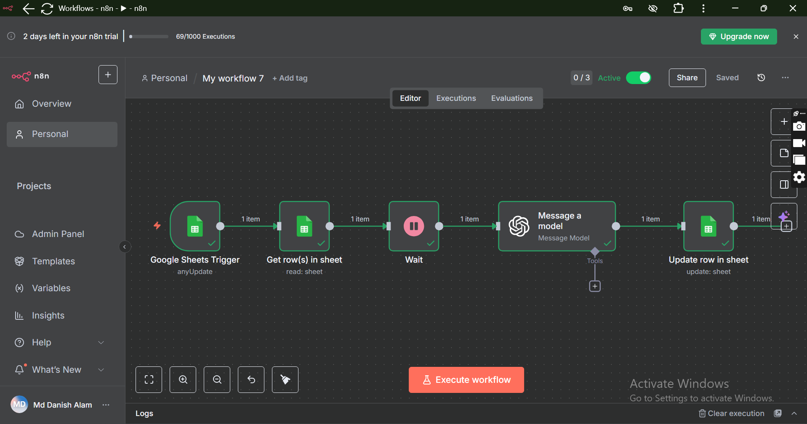
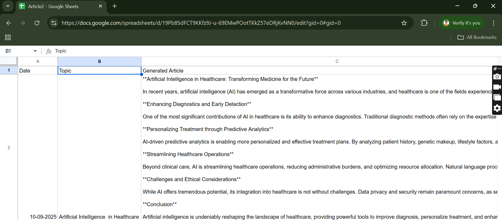
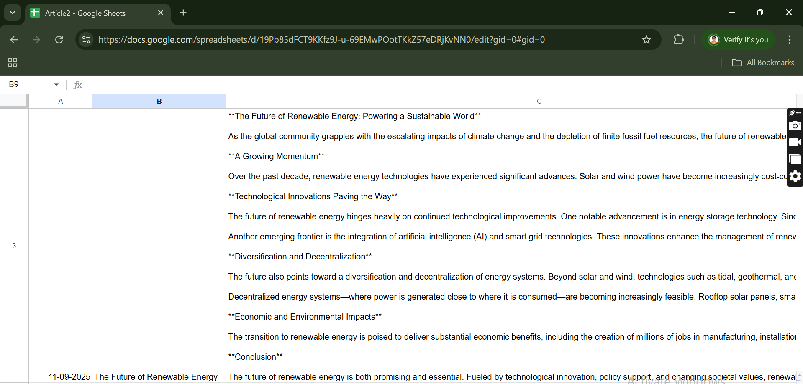

# 📝 AI Automation Article Generator

This project is an **AI-powered automation workflow** built using **n8n** and **Google Sheets**, designed for **non-technical users** (like HR professionals) who want to generate articles without writing prompts.

Instead of dealing with complex chatbot prompts, users only need to enter a **date** and an **article topic** in a Google Sheet. The workflow then connects with **OpenAI GPT-4 (or any AI writing tool)** and automatically generates a structured **~500-word article**.

---

## 🚀 Features
- 🗓️ Input **date** and **topic** directly in Google Sheets.  
- 🤖 Automatically generates a **500-word article** using GPT-4.  
- 🖇️ User-friendly for **non-technical HR professionals**.  
- ⚡ Fully automated workflow with **n8n.io**.  
- 📂 Generated articles can be stored or extended to publishing platforms.  

---

## ⚙️ Tech Stack
- **Google Sheets** → Input interface for users.  
- **n8n.io** → Workflow automation engine.  
- **OpenAI GPT-4 API** → AI-powered content generation.  

---

## 📌 Why This Project?
Most chatbot-based article generators require users to **write prompts**, which can be confusing for non-technical people.  
This workflow simplifies the process → users just add *date* and *topic*, and the AI does the rest.  
It saves time and makes AI content generation accessible for everyone.  

---

## 📷 Workflow & Output
### Workflow

### Example Input/Output
| Input (Google Sheet) | Generated Article (Output) |
|-----------------------|-----------------------------|
| `10-09-2025, AI in Healthcare` | AI-generated 500-word article on *AI in Healthcare* |

  
  

---

## 🛠️ Future Scope
- Integration with **Notion / WordPress / Medium** for direct publishing.  
- Multi-language support for global usage.  
- Adding **email automation** to send articles directly to stakeholders.  

---

## 👨‍💻 Author
**Md Danish Alam**  
📌 Passionate about **AI, Automation, and Workflow Design**.  

---

✨ With this project, generating articles becomes **as easy as filling out a Google Sheet!**
